# Reconnaissance d'attributs de cartes à jouer par réseaux de neurones convolutifs

*Object recognition in the wild using Convolutional Neural Networks*
**Practical Work 05 – Transfer learning, partie 2**

**Florian Duruz – Rémy Bleuer**
HEIG-VD – Cours ARN – Juin 2026

---

## 1. Introduction

L'objectif de ce travail pratique est de construire de bout en bout une application de reconnaissance d'objets : création d'un jeu de données à partir de nos propres photographies, exploration et préparation des données, augmentation, entraînement de réseaux de neurones convolutifs par apprentissage par transfert (transfer learning), évaluation des performances, puis déploiement et test du système en conditions réelles sur smartphone.

Nous avons choisi de réaliser un scanner de cartes à jouer : l'utilisateur pointe la caméra de son smartphone sur une carte et l'application identifie ses attributs en temps réel. Plutôt que d'entraîner un unique classifieur, le scanner reconnaît quatre attributs indépendants d'une même carte : la couleur du jeu dont elle provient (bleu, jaune, noir, rose ou rouge), son enseigne (carreau, cœur, pique ou trèfle), la figure qu'elle représente le cas échéant (joker, reine, roi ou valet) et sa valeur numérique (du 2 au 10, plus l'as). Quatre modèles distincts sont donc entraînés, un par attribut, et exécutés en parallèle sur la même image au moment de l'inférence.

La méthodologie suivie est celle du transfer learning : nous réutilisons un réseau MobileNetV2 pré-entraîné sur ImageNet (environ 1,4 million d'images) comme extracteur de caractéristiques, dont les poids sont gelés, et nous entraînons uniquement quelques couches ajoutées au-dessus. Cette approche permet d'obtenir des modèles exploitables avec quelques centaines d'images par tâche seulement, là où un entraînement complet en nécessiterait des dizaines de milliers. Les données sont nos propres photographies de cartes, prises sur fond sombre, à partir de plusieurs jeux de cartes physiques. La sélection des modèles repose sur une validation croisée stratifiée à 5 folds, et l'évaluation finale sur un jeu de test mis de côté dès le départ, complétée par des tests en conditions réelles sur smartphone avec un jeu de cartes étranger au dataset.

## 2. Le problème

Chacune des quatre tâches est un problème de classification d'images multi-classes : étant donné la photographie d'une carte, prédire respectivement sa couleur de jeu (5 classes), son enseigne (4 classes), sa figure (4 classes) ou sa valeur (10 classes). Les quatre tâches partagent la même nature d'entrée mais diffèrent fortement en difficulté : distinguer des couleurs est une tâche de bas niveau pour laquelle un CNN est naturellement armé, distinguer des enseignes exige de reconnaître la forme des symboles (cœur et carreau sont tous deux rouges, pique et trèfle tous deux noirs, la couleur seule ne suffit donc pas), tandis que distinguer un 8 d'un 9 revient implicitement à compter des symboles, ce qui est très éloigné des caractéristiques apprises sur ImageNet.

Le tableau ci-dessous résume la composition du jeu de données après séparation train/test (80 % / 20 %, stratifiée par classe). Au total, 1748 images d'entraînement et 430 images de test ont été collectées, réparties entre les quatre tâches.

| Tâche | Classes | Train | Test | Équilibre (min/max) |
|---|---|---|---|---|
| couleur | bleu, jaune, noir, rose, rouge | 556 | 138 | 0.20 (déséquilibré) |
| type | carreau, coeur, pique, trefle | 584 | 144 | 1.00 (équilibré) |
| figure | joker, reine, roi, valet | 158 | 38 | 0.51 (déséquilibré) |
| chiffre | 2 à 10, as | 450 | 110 | 1.00 (équilibré) |

Il s'agit clairement d'un contexte « small data » : les tâches type et chiffre sont parfaitement équilibrées par construction, mais couleur est fortement déséquilibrée (212 images « rouge » contre 42 « jaune » en entraînement, soit un ratio de 0.20) et figure ne dispose que d'environ 50 images par classe (23 seulement pour le joker). Ces caractéristiques laissent présager des difficultés de généralisation pour les tâches les moins dotées.

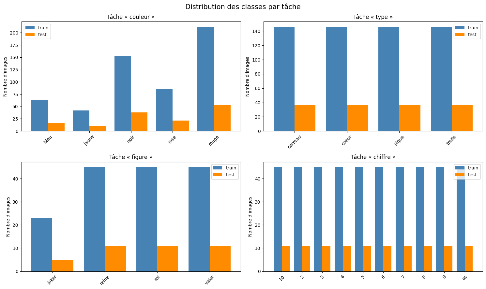
*Figure 1 – Distribution des classes (train et test) pour les quatre tâches.*

Les exemples ci-dessous illustrent la diversité intra-classe et la similarité inter-classes. Pour la tâche type, les cartes d'une même enseigne varient par leur valeur, leur orientation et leur jeu d'origine (diversité intra-classe élevée), tandis que des enseignes différentes partagent couleur et disposition générale (similarité inter-classes élevée) : c'est ce qui rend le problème non trivial.

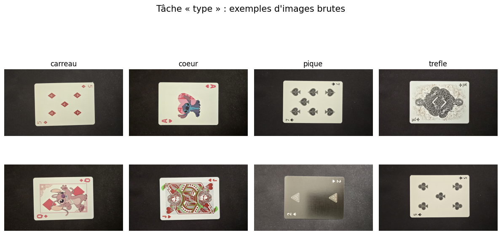
*Figure 2 – Exemples d'images brutes pour la tâche type.*

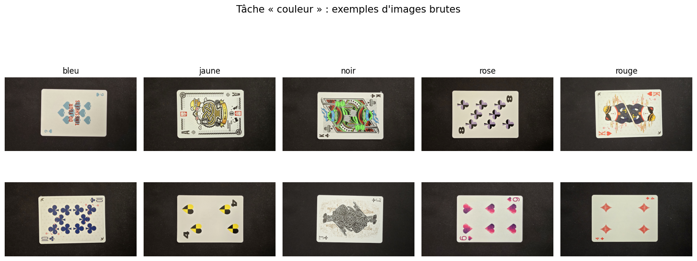
*Figure 3 – Exemples d'images brutes pour la tâche couleur.*

## 3. Préparation des données

Les photographies ont été livrées sous forme de quatre archives, une par tâche, dont les sous-dossiers correspondent aux classes. Quelques images présentes à la racine des archives, sans étiquette de classe, ont été écartées du jeu de données. Chaque tâche a ensuite été séparée en un ensemble d'entraînement (80 %) et un ensemble de test (20 %) par un tirage aléatoire stratifié par classe et reproductible (graine fixée), le jeu de test étant mis de côté et utilisé une seule fois, pour l'évaluation finale.

Le prétraitement appliqué à chaque image comporte deux étapes : un redimensionnement à 224 × 224 pixels avec recadrage au ratio (crop to aspect ratio), taille d'entrée attendue par MobileNetV2, puis une normalisation des intensités de [0, 255] vers [0, 1]. Les images sont par ailleurs converties en RGB afin de gérer uniformément les éventuels canaux alpha ou images en niveaux de gris.

Pour compenser la petite taille du dataset, une augmentation de données est appliquée à l'entraînement : miroir horizontal aléatoire, rotation aléatoire (±36°), zoom aléatoire (±20 %), translation aléatoire (±10 %), variation de contraste (±20 %) et variation de luminosité (±20 %). Concrètement, chaque ensemble d'entraînement est doublé en concaténant les images originales et une version augmentée de chacune. Conformément aux bonnes pratiques, l'augmentation n'est appliquée ni aux images de validation ni aux images de test : on veut mesurer les performances sur des images réelles, pas sur des images transformées aléatoirement. De plus, l'augmentation est effectuée après le découpage des folds de validation croisée, ce qui exclut toute fuite de données entre entraînement et validation.

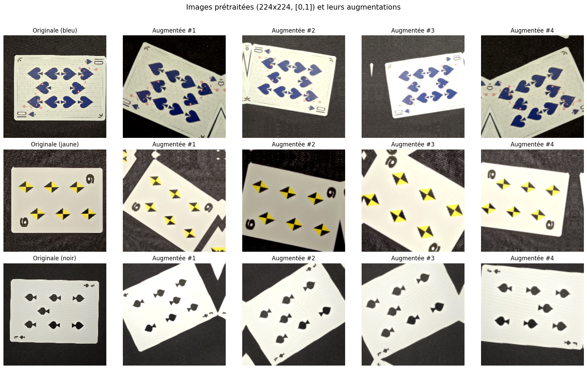
*Figure 4 – Image prétraitée (à gauche) et quatre versions augmentées.*

## 4. Création du modèle

### 4.1 Architecture et transfer learning

Les quatre modèles partagent la même architecture. La base est un MobileNetV2 pré-entraîné sur ImageNet, utilisé sans sa couche de classification (`include_top=False`) et entièrement gelé : ses 2,26 millions de paramètres ne sont pas mis à jour pendant l'entraînement. Au-dessus de cette base sont ajoutées les couches suivantes : un Global Average Pooling 2D (indispensable, à la place d'un Flatten, pour permettre le calcul de cartes d'activation de classe par la suite), un Dropout à 0.3, une couche dense de 128 neurones avec activation ReLU, un second Dropout à 0.3, et enfin une couche dense de sortie softmax dont la taille correspond au nombre de classes de la tâche (5, 4, 4 ou 10). Seule cette tête de classification est entraînée, soit environ 165 000 paramètres entraînables (164 613 pour couleur, 164 484 pour type et figure, 165 258 pour chiffre) sur un total d'environ 2,42 millions.

Le recours au transfer learning est motivé par la taille du dataset : avec 158 à 584 images d'entraînement par tâche, entraîner un CNN complet depuis zéro conduirait à un sur-apprentissage massif. MobileNetV2 a déjà appris sur ImageNet des caractéristiques visuelles génériques (contours, textures, formes, motifs colorés) directement réutilisables pour nos cartes ; il ne reste à apprendre que la combinaison de ces caractéristiques propre à nos classes, ce qui est réalisable avec peu de données. MobileNetV2 présente en outre l'avantage d'être léger, ce qui facilite le déploiement sur smartphone.

### 4.2 Hyperparamètres et sélection du modèle

Les hyperparamètres retenus sont les suivants : optimiseur RMSprop avec un taux d'apprentissage de 10⁻⁴, fonction de perte Sparse Categorical Crossentropy, 20 époques, taille de batch de 32, et l'augmentation de données décrite à la section 3. La sélection et la validation du modèle reposent sur une validation croisée stratifiée à 5 folds appliquée indépendamment à chacune des quatre tâches : à chaque fold, un modèle neuf est instancié et entraîné sur 4/5 des données (augmentées), puis évalué sur le cinquième restant, non augmenté. Cette procédure fournit une estimation de la performance attendue (moyenne) et de sa stabilité (écart-type) sans sacrifier définitivement de données. Une fois la configuration validée, un modèle final par tâche est ré-entraîné sur 100 % des données d'entraînement, puis évalué une unique fois sur le jeu de test.

Les modèles déployés sur smartphone ont été ré-entraînés avec exactement le même notebook, les mêmes données, le même découpage (graine identique) et la même configuration ; seuls les poids diffèrent légèrement du fait de l'initialisation aléatoire. Les métriques hors-ligne présentées dans ce rapport proviennent du run documenté de bout en bout.

## 5. Résultats

### 5.1 Validation croisée

Le tableau et la figure ci-dessous présentent l'exactitude (accuracy) de validation moyenne sur les 5 folds, à l'issue des 20 époques. La hiérarchie de difficulté anticipée à la section 2 se vérifie pleinement : couleur en tête, type ensuite, figure et chiffre nettement en retrait. À titre de référence, une prédiction aléatoire donnerait 20 % (couleur), 25 % (type et figure) et 10 % (chiffre).

| Tâche | Accuracy de validation (moyenne ± écart-type) | Hasard |
|---|---|---|
| couleur | 80.8 % ± 4.5 | 20 % |
| type | 64.7 % ± 4.6 | 25 % |
| figure | 33.0 % ± 12.4 | 25 % |
| chiffre | 36.7 % ± 2.9 | 10 % |

Deux observations méritent d'être soulignées. D'une part, l'écart-type très élevé de figure (±12.4 points) traduit l'instabilité d'un apprentissage sur un dataset minuscule : selon les images qui tombent dans le fold de validation, le score varie du simple au double. D'autre part, les courbes d'apprentissage montrent que pour chiffre et figure, l'accuracy de validation progresse encore à la vingtième époque : ces deux modèles sont sous-entraînés, et un nombre d'époques plus élevé aurait vraisemblablement amélioré leurs scores. Nous avons conservé 20 époques pour toutes les tâches par cohérence et par contrainte de temps de calcul.

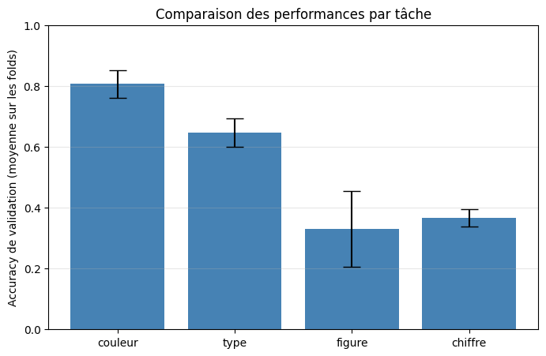
*Figure 5 – Comparaison de l'accuracy de validation moyenne (± écart-type) des quatre tâches.*

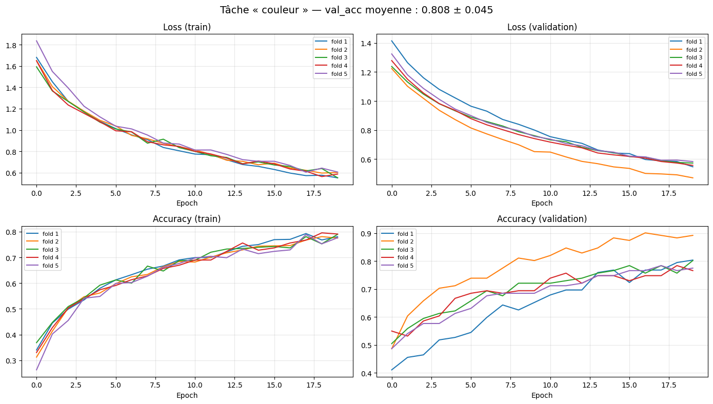
*Figure 6 – Courbes de validation croisée, tâche couleur.*

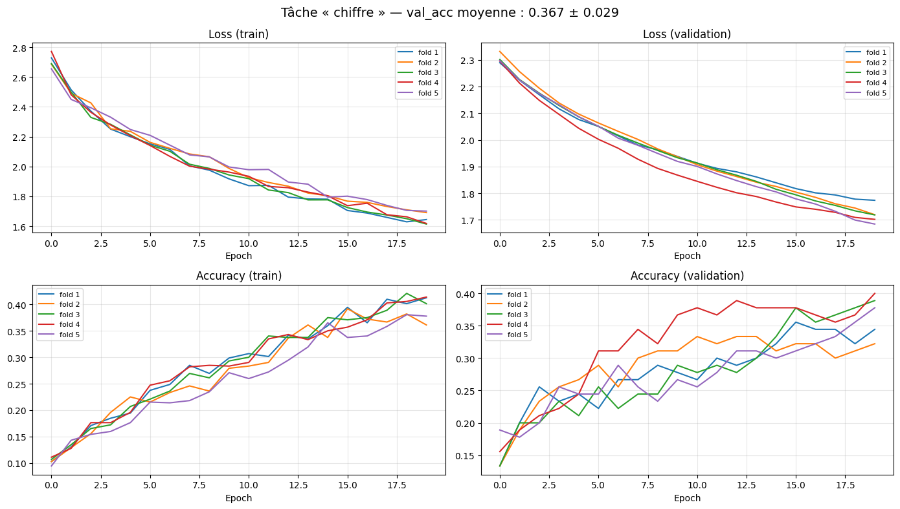
*Figure 7 – Courbes de validation croisée, tâche chiffre (progression encore en cours à l'époque 20).*

### 5.2 Évaluation sur le jeu de test

Les modèles finaux, ré-entraînés sur l'ensemble des données d'entraînement, ont été évalués sur les jeux de test. Le tableau suivant résume les résultats globaux ; les f-scores par classe sont détaillés ensuite.

| Tâche | Accuracy test | F1-score macro | Accuracy validation (CV) |
|---|---|---|---|
| couleur | 85.5 % | 0.83 | 80.8 % |
| type | 72.9 % | 0.73 | 64.7 % |
| figure | 39.5 % | 0.44 | 33.0 % |
| chiffre | 30.9 % | 0.29 | 36.7 % |

Les performances sur le test sont proches des performances de validation, voire légèrement supérieures pour couleur, type et figure : c'est cohérent, puisque les modèles finaux ont bénéficié de 25 % de données d'entraînement supplémentaires par rapport aux modèles des folds. L'absence d'écart important entre validation et test indique que la procédure de sélection n'a pas sur-ajusté la configuration aux données de validation.

**F-scores par classe.** Pour couleur (f1 macro 0.83) : noir 0.90, rouge 0.88, jaune 0.84, rose 0.82, bleu 0.69 — la classe bleu, la moins représentée avec la classe jaune, est la plus faible. Pour type (0.73) : carreau 0.83, coeur 0.80, pique 0.64, trefle 0.67 — les deux enseignes rouges sont bien reconnues, les deux enseignes noires se confondent mutuellement, comme le détaille la matrice de confusion. Pour figure (0.44) : joker 0.80, reine 0.24, roi 0.37, valet 0.36 — seul le joker, visuellement très distinctif, est correctement séparé ; les trois personnages se confondent. Pour chiffre (0.29) : les valeurs extrêmes s'en sortent le mieux (2 : 0.61, as : 0.60), tandis que le 8 et le 10 ont un f1 de 0.00 — aucun exemple correctement reconnu — et les valeurs intermédiaires plafonnent entre 0.13 et 0.44 : compter 7, 8 ou 9 symboles est hors de portée des caractéristiques gelées d'ImageNet.

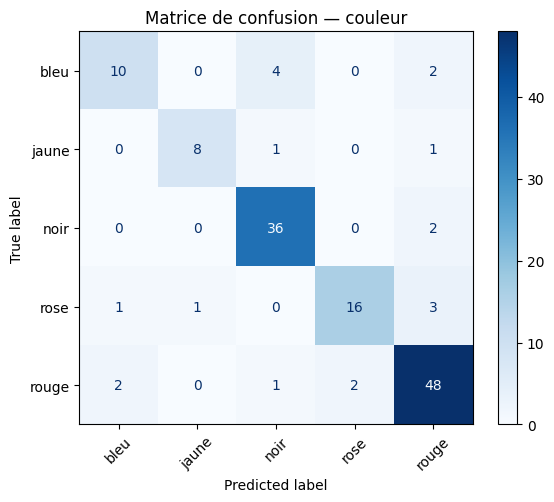
*Figure 8 – Matrice de confusion, couleur.*

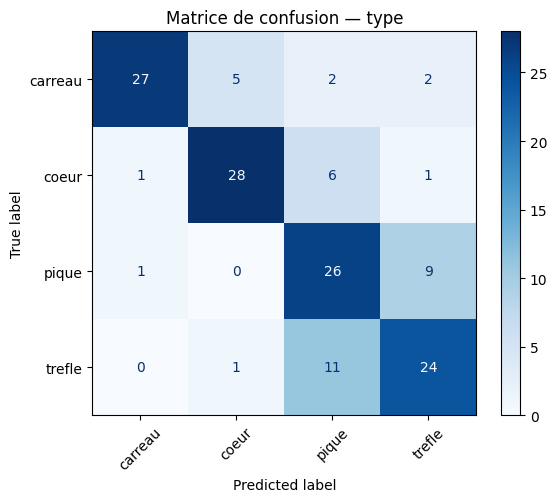
*Figure 9 – Matrice de confusion, type.*

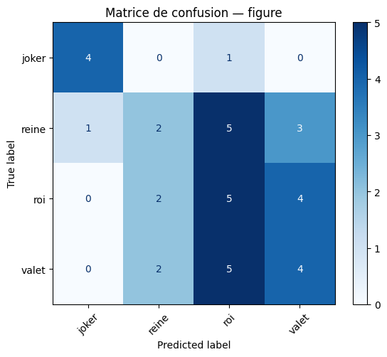
*Figure 10 – Matrice de confusion, figure.*

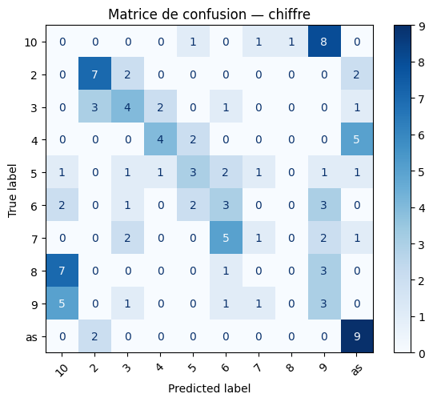
*Figure 11 – Matrice de confusion, chiffre.*

La matrice de confusion de type est particulièrement instructive : sur 36 trèfles de test, 10 sont prédits pique, et sur 36 piques, 7 sont prédits trèfle — la confusion est massivement concentrée entre les deux enseignes noires, alors que cœur et carreau, qui ne se distinguent eux aussi que par la forme de leurs symboles, sont mieux séparés, probablement parce que la forme pleine et anguleuse du carreau diffère davantage du cœur que la silhouette du trèfle ne diffère de celle du pique.

### 5.3 Analyse par cartes d'activation de classe (Grad-CAM++)

Pour vérifier que les modèles fondent leurs décisions sur des régions pertinentes de l'image, nous avons calculé des cartes d'activation de classe avec la méthode Grad-CAM++. La figure 12 montre, pour la tâche type, les régions qui activent le plus le modèle sur des images correctement classées ; la figure 13 montre la même analyse sur des images mal classées du jeu de test.

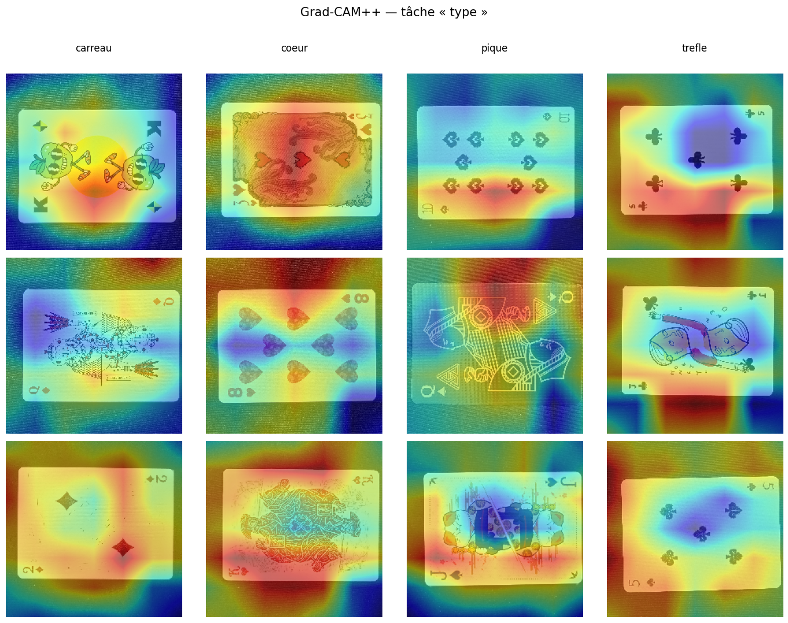
*Figure 12 – Grad-CAM++ sur des images d'entraînement, tâche type.*

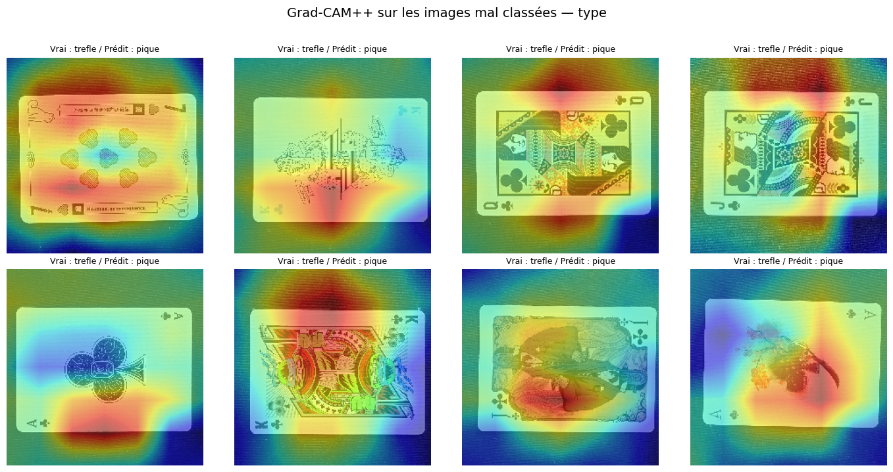
*Figure 13 – Grad-CAM++ sur des images de test mal classées, tâche type (toutes sont des trèfles prédits pique).*

Le constat est sans appel : sur de nombreuses images, la zone de plus forte activation (en rouge) ne se trouve pas sur les symboles de la carte mais sur ses bords, voire sur l'arrière-plan au-dessus et en dessous de la carte. Le modèle s'appuie donc en partie sur le contexte plutôt que sur l'objet — un cas typique de « shortcut learning », rendu possible par le fait que toutes les photos d'entraînement partagent le même type de fond sombre. Sur les images mal classées (figure 13), ce phénomène est encore plus marqué : quand les symboles ne suffisent pas à trancher entre trèfle et pique, le modèle se rabat sur des indices de fond qui ne portent aucune information sur l'enseigne. Cette observation prédit directement une dégradation des performances lorsque le fond change, ce que les tests en conditions réelles confirmeront.

### 5.4 Images mal classées

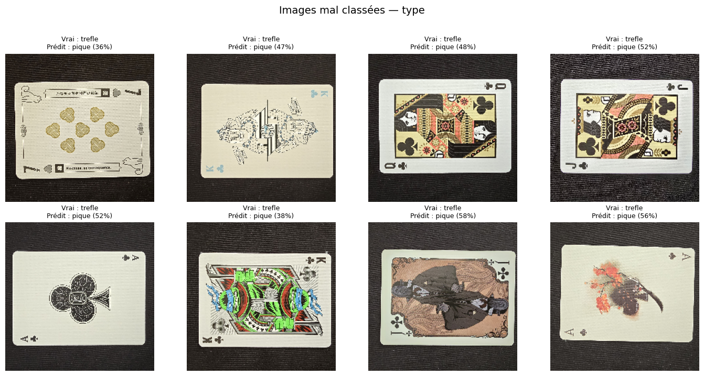
*Figure 14 – Exemples d'images de test mal classées, tâche type (étiquette réelle, prédiction et confiance).*

L'examen des erreurs du jeu de test (20/138 pour couleur, 39/144 pour type, 23/38 pour figure, 76/110 pour chiffre) confirme les patterns des matrices de confusion : pour type, la quasi-totalité des erreurs sont des confusions entre enseignes de même couleur, souvent avec une confiance modérée ; pour figure, les personnages se confondent entre eux ; pour chiffre, les valeurs voisines sont systématiquement mélangées. On note également que plusieurs erreurs concernent des figures (roi, dame, valet) présentes dans le dataset type : leurs grandes illustrations centrales masquent une partie des symboles d'enseigne, ne laissant que les petits symboles de coin pour trancher.

### 5.5 Tests en conditions réelles sur smartphone

Les quatre modèles ont été convertis au format TensorFlow.js et intégrés dans une application web mobile qui exécute les quatre classifications en parallèle sur le flux de la caméra, avec un seuil d'incertitude réglable (fixé à 55-60 % lors des tests) en dessous duquel la prédiction est remplacée par « Incertain ». Les tests ont été volontairement menés en conditions difficiles : un jeu de cartes ancien, totalement étranger au dataset d'entraînement (style graphique différent), photographié sur un fond clair alors que tout l'entraînement s'est fait sur fond sombre. Le tableau suivant récapitule les neuf tests effectués.

| Carte réelle | couleur | type | figure | chiffre |
|---|---|---|---|---|
| Valet de cœur | Rouge 82 % | Coeur 74 % ✓ | Roi 82 % ✗ | As 71 % (absurde) |
| As de cœur | Rouge 78 % | Coeur 76 % ✓ | Incertain ✓ | 2 69 % ✗ |
| Roi de pique | Incertain | Incertain ✗ | Roi 88 % ✓ | As 86 % (absurde) |
| Reine de cœur | Rouge 61 % | Incertain ✗ | Roi 65 % ✗ | As 69 % (absurde) |
| 10 de trèfle | Noir 68 % | Incertain ✗ | Incertain ✓ | Incertain ✗ |
| 9 de trèfle | Noir 99 % | Trefle 65 % ✓ | Incertain ✓ | Incertain ✗ |
| 8 de carreau | Rouge 96 % | Carreau 97 % ✓ | Incertain ✓ | Incertain ✗ |
| Valet de carreau | Rouge 83 % | Incertain ✗ | Incertain ✗ | As 68 % (absurde) |
| 6 de pique | Jaune 56 % ✗ | Pique 80 % ✓ | Incertain ✓ | Incertain ✗ |

*Note : la tâche couleur prédit le jeu d'origine de la carte ; le jeu de test ne faisant partie d'aucune des cinq classes, ses prédictions n'ont pas de vérité terrain à proprement parler, à l'exception du « Jaune 56 % » manifestement aberrant pour un jeu aux symboles noirs sur la dernière ligne.*

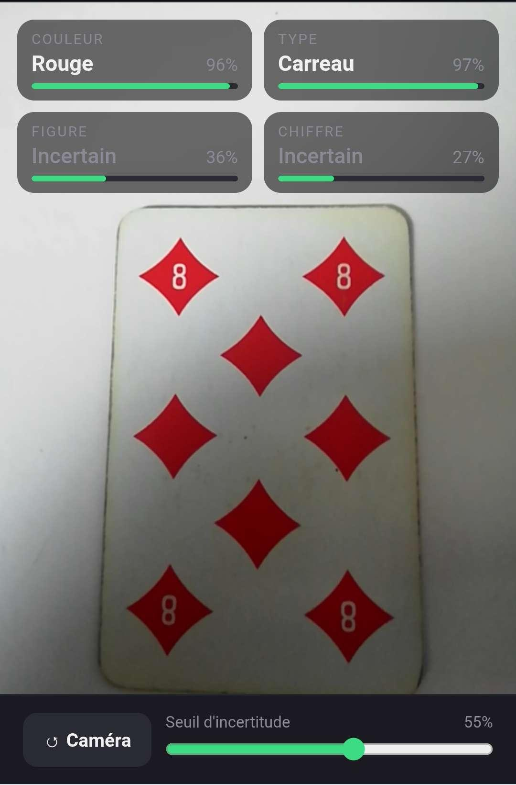
*Figure 15 – Cas favorable : 8 de carreau (Rouge 96 %, Carreau 97 %, figure et chiffre incertains).*

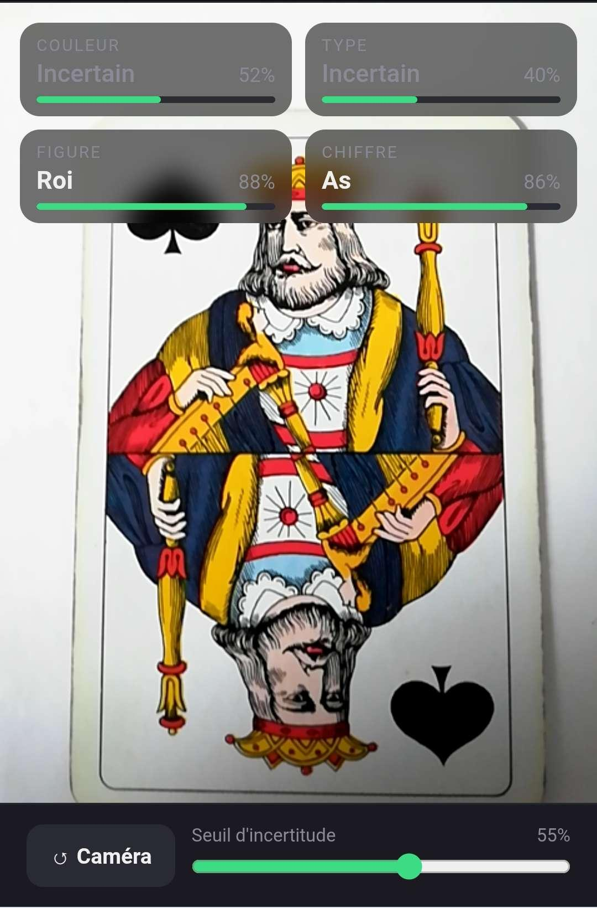
*Figure 16 – Roi de pique : figure correcte (Roi 88 %) mais le modèle chiffre prédit « As » à 86 %.*

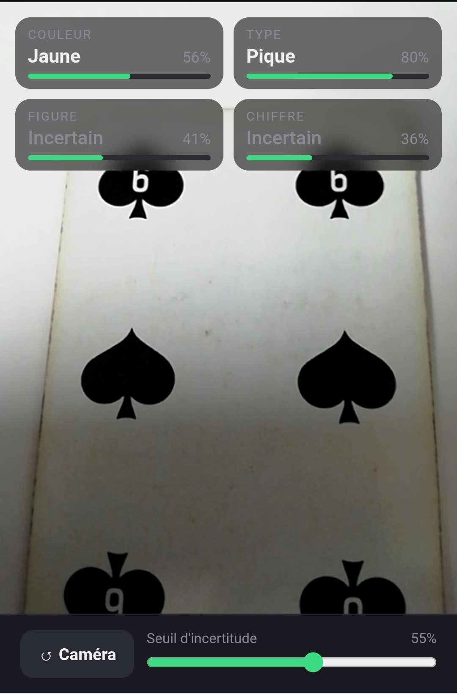
*Figure 17 – 6 de pique : type correct (Pique 80 %) mais couleur aberrante (« Jaune 56 % ») sur fond clair.*

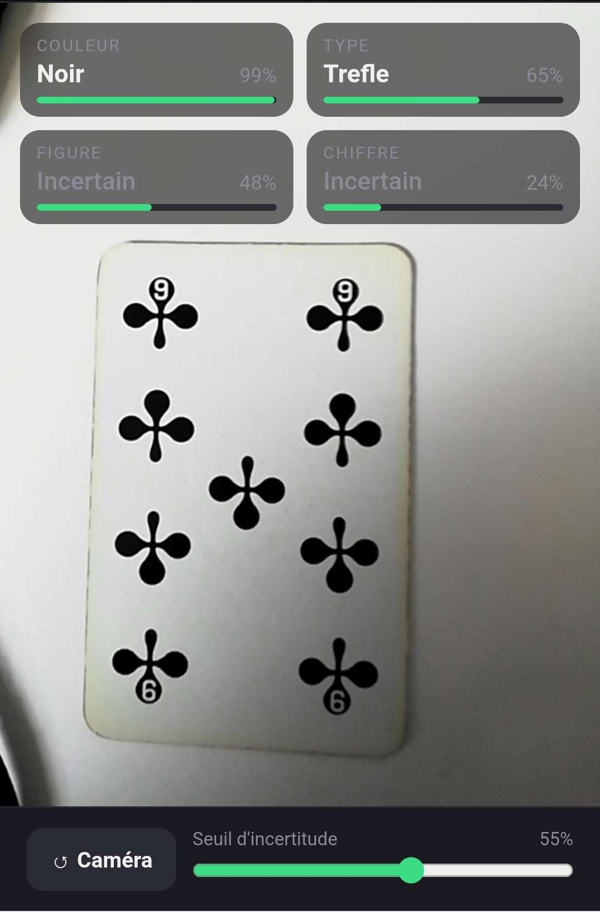
*Figure 18 – 9 de trèfle : Noir 99 % et Trèfle 65 %, valeur non reconnue.*

Trois enseignements se dégagent de ces tests. Premièrement, la hiérarchie observée hors-ligne se maintient en conditions réelles : type reste la tâche la plus fiable (5 prédictions correctes sur 9, 4 abstentions, et surtout aucune erreur émise avec confiance — quand le modèle se trompe, il reste sous le seuil et s'abstient, ce qui est le comportement le plus sûr possible pour un système imparfait), tandis que chiffre échoue sur la totalité des cartes. Deuxièmement, le double décalage de domaine (jeu de cartes inconnu, fond clair au lieu de sombre) dégrade visiblement les confiances par rapport au test hors-ligne et produit des aberrations comme le « Jaune 56 % », confirmant exactement ce que l'analyse Grad-CAM laissait prévoir : un modèle qui s'appuie sur le fond généralise mal à un fond nouveau. Troisièmement, le test révèle un défaut structurel de notre conception : les tâches figure et chiffre sont mutuellement exclusives (une carte est soit une figure, soit une carte à nombre), mais un classifieur softmax produit toujours une prédiction. Face à un roi, le modèle chiffre prédit systématiquement « As » avec 68 à 86 % de confiance — au-dessus du seuil, donc affiché — vraisemblablement parce que l'as, qui ne comporte qu'un grand symbole central, est la classe la plus proche visuellement d'une figure dominée par une grande illustration. C'est la réponse expérimentale à la question du comportement du système face à des objets n'appartenant à aucune classe : il produit des prédictions absurdes avec une confiance élevée.

### 5.6 Pistes d'amélioration du dataset et du système

Les analyses précédentes suggèrent des améliorations concrètes. Pour le dataset : diversifier les arrière-plans et les conditions d'éclairage lors des prises de vue, afin de casser la corrélation entre fond et classe qui alimente le shortcut learning ; augmenter le nombre d'images des tâches figure et chiffre, qui sont les plus pauvres ; rééquilibrer la tâche couleur (les classes bleu et jaune, cinq fois moins fournies que rouge, obtiennent les plus mauvais f-scores) ; et intégrer plusieurs jeux de cartes de styles différents pour améliorer la généralisation à des jeux inconnus. Pour le système : ajouter à chaque modèle une classe de rejet (une classe « nombre » au modèle figure et une classe « figure » au modèle chiffre, constituables sans aucune photo supplémentaire en réutilisant les images existantes), ou placer en amont un classifieur binaire figure/nombre qui aiguille vers le bon modèle ; augmenter le nombre d'époques pour les tâches sous-entraînées ; et envisager un fine-tuning des dernières couches de MobileNetV2 avec un taux d'apprentissage très faible, en particulier pour chiffre dont la tâche (compter des symboles) est la plus éloignée des caractéristiques d'ImageNet.

## 6. Conclusions

Ce travail nous a fait parcourir l'intégralité du cycle de vie d'une application de classification d'images : constitution d'un dataset original de plus de 2000 photographies, préparation et augmentation des données, entraînement par transfer learning de quatre classifieurs MobileNetV2, sélection par validation croisée, évaluation sur jeu de test, analyse par Grad-CAM++ et déploiement réel sur smartphone via TensorFlow.js.

Les résultats illustrent de manière frappante que la difficulté d'une tâche de classification ne dépend pas du nombre de classes mais de la nature des caractéristiques discriminantes : avec la même architecture et les mêmes données de base, la reconnaissance de la couleur du jeu atteint 85.5 % d'accuracy en test et l'enseigne 72.9 %, tandis que la reconnaissance des figures (39.5 %) et des valeurs (30.9 %) reste proche de l'inutilisable — compter des symboles ou distinguer des personnages finement dessinés excède ce que des caractéristiques ImageNet gelées peuvent offrir avec si peu de données. L'analyse Grad-CAM a par ailleurs révélé une dépendance partielle des modèles à l'arrière-plan, dont les tests en conditions réelles — menés sur un jeu de cartes inconnu et un fond différent — ont confirmé les conséquences : confiances en baisse, abstentions fréquentes et prédictions aberrantes ponctuelles. Ces mêmes tests ont enfin mis en évidence une limite de conception, l'absence de mécanisme de rejet pour les tâches mutuellement exclusives, le modèle des valeurs prédisant « As » avec une confiance élevée face à n'importe quelle figure.

Le système constitue néanmoins une preuve de concept fonctionnelle : deux attributs sur quatre sont reconnus de façon exploitable en temps réel sur smartphone, le seuil d'incertitude offre un garde-fou efficace (aucune erreur confiante du modèle type en conditions réelles), et chaque faiblesse identifiée est expliquée et assortie d'un remède concret. Les travaux futurs les plus prometteurs sont l'enrichissement et la diversification du dataset (fonds, éclairages, jeux de cartes), l'ajout de classes de rejet pour gérer l'exclusivité figure/chiffre, l'allongement de l'entraînement des tâches sous-entraînées et le fine-tuning partiel du réseau de base.
