# Reconnaissance d'attributs de cartes à jouer par réseaux de neurones convolutifs

*Object recognition in the wild using Convolutional Neural Networks*
**Practical Work 05 – Transfer learning, partie 2**

**Florian Duruz, Rémy Bleuer**
HEIG-VD – Cours ARN – Juin 2026

---

## 1. Introduction

L'objectif de ce travail pratique est de construire de bout en bout une application de reconnaissance d'objets : création d'un jeu de données à partir de nos propres photographies, exploration et préparation des données, augmentation, entraînement de réseaux de neurones convolutifs par apprentissage par transfert (transfer learning), évaluation des performances, puis déploiement et test du système en conditions réelles sur smartphone.

Nous avons choisi de réaliser un scanner de cartes à jouer : l'utilisateur pointe la caméra de son smartphone sur une carte et l'application identifie ses attributs en temps réel. Plutôt que d'entraîner un unique classifieur, le scanner reconnaît quatre attributs indépendants d'une même carte au moyen de quatre modèles exécutés en parallèle :

- **couleur** : la couleur du jeu dont provient la carte (bleu, jaune, noir, rose ou rouge) ;
- **type** : l'enseigne de la carte (carreau, cœur, pique ou trèfle) ;
- **symbole** : la valeur de la carte, qu'il s'agisse d'un nombre (as à 10) ou d'une figure (valet, reine, roi, joker), soit 14 classes ;
- **deck** : le jeu de cartes précis dont provient la carte (deck1 à deck16), ou la classe « autre » si la carte ne provient d'aucun jeu connu, soit 17 classes.

Deux choix de conception méritent d'être soulignés dès l'introduction. D'une part, regrouper nombres et figures dans une unique tâche **symbole** évite le problème d'exclusivité mutuelle que poserait la séparation en deux modèles (figure et nombre étant exclusifs sur une carte, deux modèles softmax distincts se contrediraient systématiquement). D'autre part, l'ajout d'une classe **« autre »** à la tâche **deck** dote le système d'un mécanisme de rejet explicite, lui permettant de signaler qu'une carte ne provient d'aucun jeu connu.

La méthodologie suivie est celle du transfer learning : nous réutilisons un réseau MobileNetV2 pré-entraîné sur ImageNet (environ 1,4 million d'images) comme extracteur de caractéristiques, dont les poids sont gelés, et nous entraînons uniquement quelques couches ajoutées au-dessus. Cette approche permet d'obtenir des modèles exploitables avec quelques centaines d'images par tâche seulement. Les données sont nos propres photographies de cartes, prises sur fond sombre, à partir de seize jeux de cartes physiques différents. La sélection des modèles repose sur une validation croisée stratifiée à 5 folds, et l'évaluation finale sur un jeu de test mis de côté dès le départ, complétée par des tests en conditions réelles sur smartphone.

## 2. Le problème

Chacune des quatre tâches est un problème de classification d'images multi-classes : étant donné la photographie d'une carte, prédire respectivement sa couleur de jeu (5 classes), son enseigne (4 classes), sa valeur (14 classes) ou son jeu d'origine (17 classes). Les quatre tâches partagent la même nature d'entrée mais diffèrent fortement en difficulté : distinguer des couleurs est une tâche de bas niveau pour laquelle un CNN est naturellement armé ; distinguer des enseignes exige de reconnaître la forme des symboles (cœur et carreau sont tous deux rouges, pique et trèfle tous deux noirs, la couleur seule ne suffit donc pas) ; reconnaître la valeur revient implicitement à compter des symboles, ce qui est très éloigné des caractéristiques apprises sur ImageNet ; enfin, identifier le jeu d'origine repose sur le style graphique global de la carte (dos, polices, illustrations), un indice visuel riche et distinctif.

Le tableau ci-dessous résume la composition du jeu de données après séparation train/test (80 % / 20 %, stratifiée par classe).

| Tâche | Nb classes | Train | Test | Équilibre (min/max) |
|---|---|---|---|---|
| couleur | 5 | 556 | 138 | 0.20 (déséquilibré) |
| type | 4 | 584 | 144 | 1.00 (équilibré) |
| symbole | 14 | 608 | 148 | 0.51 (déséquilibré) |
| deck | 17 | 728 | 166 | 0.66 (déséquilibré) |

Il s'agit d'un contexte « small data ». La tâche type est équilibrée par construction, mais les trois autres présentent des déséquilibres : couleur est la plus marquée (212 images « rouge » contre 42 « jaune » en entraînement, ratio 0.20), symbole souffre de la rareté du joker (23 images contre 45 pour les autres valeurs) et deck d'une légère sous-représentation de certains jeux et de la classe « autre ». Ces caractéristiques laissent présager des difficultés de généralisation pour les classes les moins dotées.

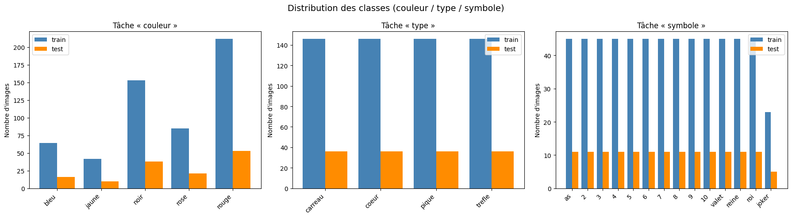
*Figure 1 : Distribution des classes (train et test) pour les tâches couleur et type.*

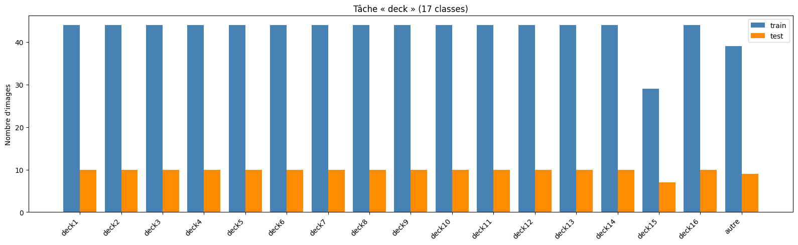
*Figure 2 : Distribution des classes (train et test) pour les tâches symbole et deck.*

Les exemples ci-dessous illustrent la diversité intra-classe et la similarité inter-classes. Pour la tâche type, les cartes d'une même enseigne varient par leur valeur, leur orientation et leur jeu d'origine (diversité intra-classe élevée), tandis que des enseignes différentes partagent couleur et disposition générale (similarité inter-classes élevée).

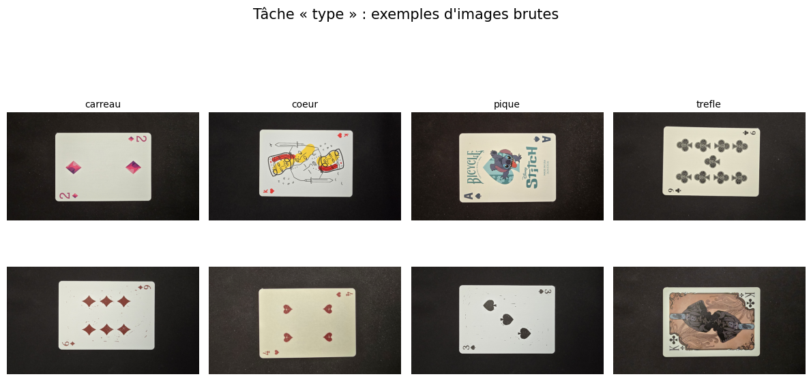
*Figure 3 : Exemples d'images brutes pour la tâche type.*

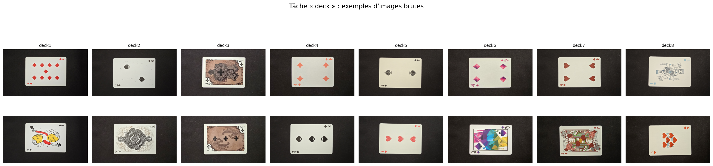
*Figure 4 : Exemples d'images brutes pour la tâche deck : les styles graphiques très différents d'un jeu à l'autre rendent cette tâche plus facile qu'il n'y paraît malgré ses 17 classes.*

## 3. Préparation des données

Les photographies ont été organisées par tâche, chaque classe correspondant à un sous-dossier. Quelques images sans étiquette de classe ont été écartées du jeu de données. Chaque tâche a ensuite été séparée en un ensemble d'entraînement (80 %) et un ensemble de test (20 %) par un tirage aléatoire stratifié par classe et reproductible (graine fixée), le jeu de test étant mis de côté et utilisé une seule fois, pour l'évaluation finale.

Le prétraitement appliqué à chaque image comporte deux étapes : un redimensionnement à 224 × 224 pixels avec recadrage au ratio (crop to aspect ratio), taille d'entrée attendue par MobileNetV2, puis une normalisation des intensités de [0, 255] vers [0, 1]. Les images sont par ailleurs converties en RGB afin de gérer uniformément les éventuels canaux alpha ou images en niveaux de gris.

Pour compenser la petite taille du dataset, une augmentation de données est appliquée à l'entraînement : miroir horizontal aléatoire, rotation aléatoire (±36°), zoom aléatoire (±20 %), translation aléatoire (±10 %), variation de contraste (±20 %) et variation de luminosité (±20 %). Concrètement, chaque ensemble d'entraînement est doublé en concaténant les images originales et une version augmentée de chacune. Conformément aux bonnes pratiques, l'augmentation n'est appliquée ni aux images de validation ni aux images de test : on veut mesurer les performances sur des images réelles, pas sur des images transformées aléatoirement. De plus, l'augmentation est effectuée après le découpage des folds de validation croisée, ce qui exclut toute fuite de données entre entraînement et validation.

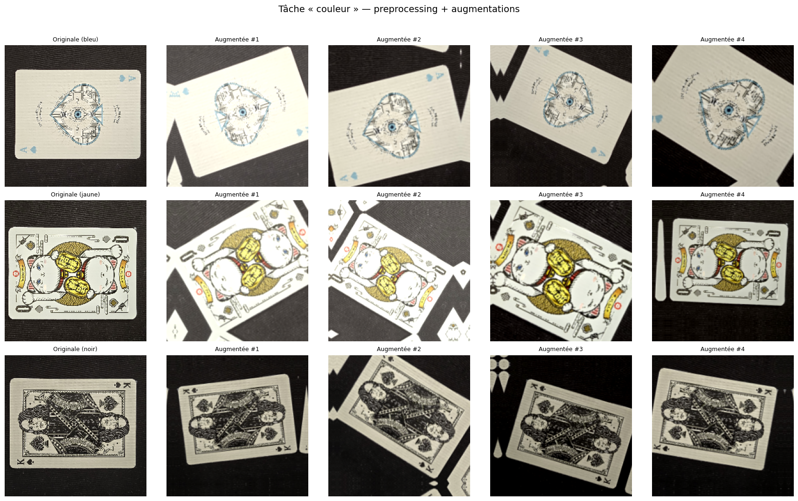
*Figure 5 : Image prétraitée (à gauche) et quatre versions augmentées.*

## 4. Création du modèle

### 4.1 Architecture et transfer learning

Les quatre modèles partagent la même architecture. La base est un MobileNetV2 pré-entraîné sur ImageNet, utilisé sans sa couche de classification (`include_top=False`) et entièrement gelé : ses 2,26 millions de paramètres ne sont pas mis à jour pendant l'entraînement. Au-dessus de cette base sont ajoutées les couches suivantes : un Global Average Pooling 2D (indispensable, à la place d'un Flatten, pour permettre le calcul de cartes d'activation de classe par la suite), un Dropout à 0.3, une couche dense de 128 neurones avec activation ReLU, un second Dropout à 0.3, et enfin une couche dense de sortie softmax dont la taille correspond au nombre de classes de la tâche (5, 4, 14 ou 17). Seule cette tête de classification est entraînée, soit de l'ordre de 165 000 à 167 000 paramètres entraînables selon la tâche, sur un total d'environ 2,42 millions.

Le recours au transfer learning est motivé par la taille du dataset : avec 556 à 728 images d'entraînement par tâche, entraîner un CNN complet depuis zéro conduirait à un sur-apprentissage massif. MobileNetV2 a déjà appris sur ImageNet des caractéristiques visuelles génériques (contours, textures, formes, motifs colorés) directement réutilisables pour nos cartes ; il ne reste à apprendre que la combinaison de ces caractéristiques propre à nos classes, ce qui est réalisable avec peu de données. MobileNetV2 présente en outre l'avantage d'être léger, ce qui facilite le déploiement sur smartphone.

### 4.2 Hyperparamètres et sélection du modèle

Les hyperparamètres retenus sont les suivants : optimiseur RMSprop avec un taux d'apprentissage de 10⁻⁴, fonction de perte Sparse Categorical Crossentropy, 20 époques, taille de batch de 32, et l'augmentation de données décrite à la section 3. La sélection et la validation du modèle reposent sur une validation croisée stratifiée à 5 folds appliquée indépendamment à chacune des quatre tâches : à chaque fold, un modèle neuf est instancié et entraîné sur 4/5 des données (augmentées), puis évalué sur le cinquième restant, non augmenté. Cette procédure fournit une estimation de la performance attendue (moyenne) et de sa stabilité (écart-type) sans sacrifier définitivement de données. Une fois la configuration validée, un modèle final par tâche est ré-entraîné sur 100 % des données d'entraînement, puis évalué une unique fois sur le jeu de test. Ce sont ces quatre modèles finaux qui sont déployés sur smartphone.

## 5. Résultats

### 5.1 Validation croisée

Le tableau ci-dessous présente l'exactitude (accuracy) de validation moyenne sur les 5 folds, à l'issue des 20 époques. À titre de référence, une prédiction aléatoire donnerait environ 20 % (couleur), 25 % (type), 7 % (symbole) et 6 % (deck).

| Tâche | Accuracy de validation (moyenne ± écart-type) | Hasard |
|---|---|---|
| couleur | 83.8 % ± 1.9 | 20 % |
| type | 64.4 % ± 3.5 | 25 % |
| symbole | 28.6 % ± 2.9 | ~7 % |
| deck | 84.1 % ± 1.2 | ~6 % |

Le résultat le plus frappant est que **deck, malgré ses 17 classes, atteint la meilleure performance du projet** (84.1 %), à égalité avec couleur. À l'inverse, symbole, qui ne compte « que » 14 classes, plafonne à 28.6 %. Cela confirme que la difficulté d'une tâche ne dépend pas du nombre de classes mais de la nature des caractéristiques discriminantes : le style graphique global d'un jeu est un indice riche et facile à capter pour un CNN, alors que compter des symboles ou distinguer finement des valeurs voisines exige des caractéristiques que MobileNetV2 gelé ne possède pas. Les faibles écarts-types de couleur et deck (1,9 et 1,2 point) indiquent des modèles très stables d'un fold à l'autre.

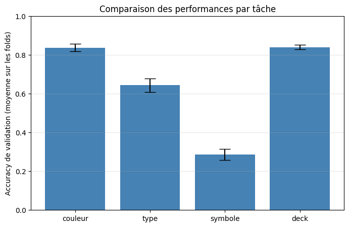
*Figure 6 : Accuracy de validation moyenne (± écart-type) des quatre tâches.*

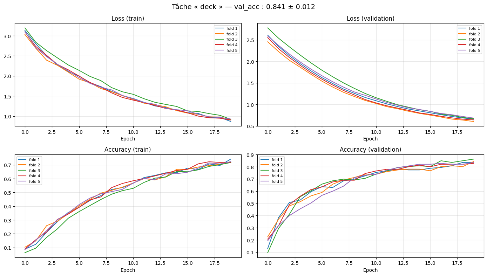
*Figure 7 : Courbes de validation croisée, tâche deck.*

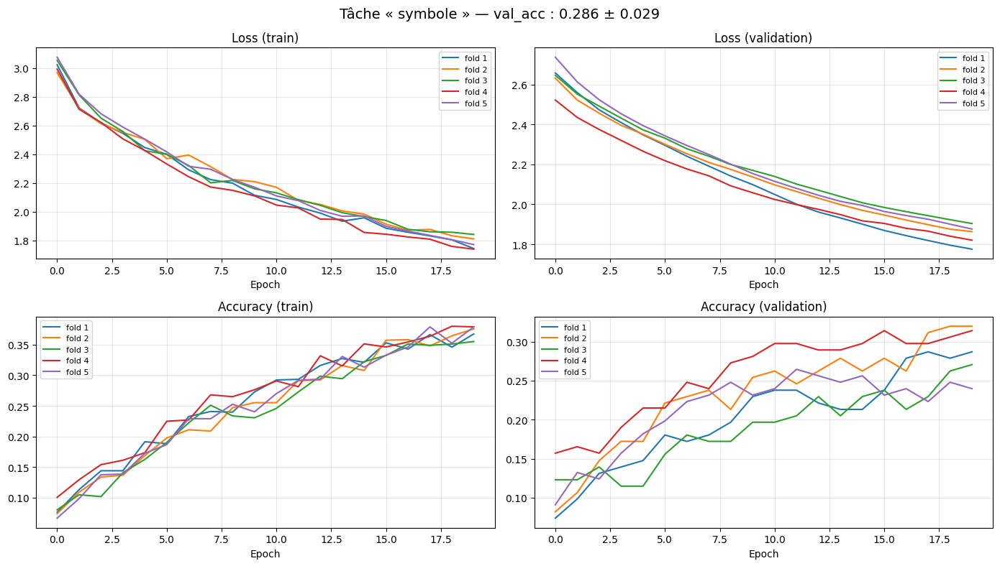
*Figure 8 : Courbes de validation croisée, tâche symbole : la progression encore en cours à l'époque 20 suggère un sous-entraînement.*

### 5.2 Évaluation sur le jeu de test

Les modèles finaux ont été évalués sur les jeux de test. Le tableau suivant résume les résultats globaux.

| Tâche | Accuracy test | F1-score macro | Accuracy validation (CV) |
|---|---|---|---|
| couleur | 79.7 % | 0.77 | 83.8 % |
| type | 69.4 % | 0.69 | 64.4 % |
| symbole | 31.1 % | 0.29 | 28.6 % |
| deck | 85.5 % | 0.86 | 84.1 % |

Les performances de test sont cohérentes avec celles de validation, ce qui indique que la procédure de sélection n'a pas sur-ajusté la configuration aux données de validation. On note un léger recul pour couleur (79.7 % contre 83.8 % en CV) et au contraire une légère progression pour type, symbole et surtout deck.

**F-scores par classe.** Pour **couleur** (f1 macro 0.77) : jaune 0.95, noir 0.84, rouge 0.83, rose 0.70, bleu 0.54, la classe bleu, peu représentée, est nettement la plus faible. Pour **type** (0.69) : cœur 0.76, carreau 0.73, trèfle 0.66, pique 0.62, les performances sont assez homogènes, les confusions se concentrant entre enseignes de même couleur. Pour **symbole** (0.29) : les valeurs extrêmes et l'as s'en sortent le mieux (as 0.70, 2 : 0.54, 3 et 4 : 0.53), tandis que le 8 et le joker ont un f1 de 0.00, et que les valeurs intermédiaires ainsi que les figures (valet 0.08, reine 0.29, roi 0.35) sont très faibles. Pour **deck** (0.86) : la majorité des jeux obtiennent un f1 supérieur à 0.85, plusieurs atteignant 1.00 (deck3, deck11, deck14, deck15), et la classe « autre » atteint 0.88, le mécanisme de rejet fonctionne donc correctement sur le jeu de test.

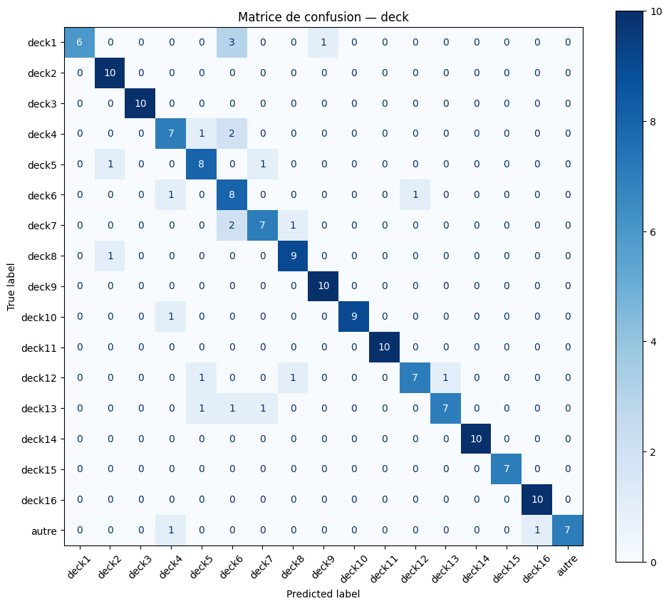
*Figure 9 : Matrice de confusion, deck (17 classes) : la diagonale très marquée illustre l'excellente séparation des jeux.*

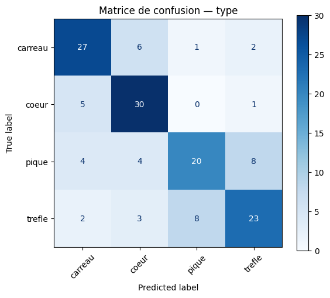
*Figure 10 : Matrice de confusion, type.*

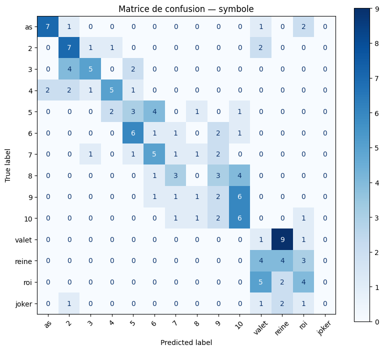
*Figure 11 : Matrice de confusion, symbole (14 classes) : les confusions se concentrent sur les valeurs voisines et entre figures.*

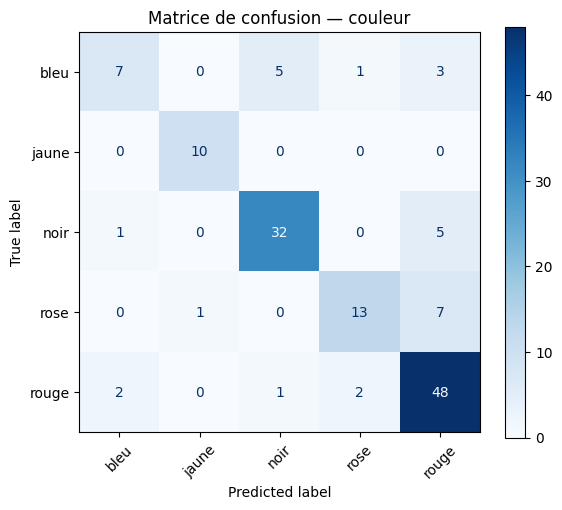
*Figure 12 : Matrice de confusion, couleur.*

### 5.3 Analyse par cartes d'activation de classe (Grad-CAM++)

Pour vérifier sur quelles régions les modèles fondent leurs décisions, nous avons calculé des cartes d'activation de classe avec la méthode Grad-CAM++.

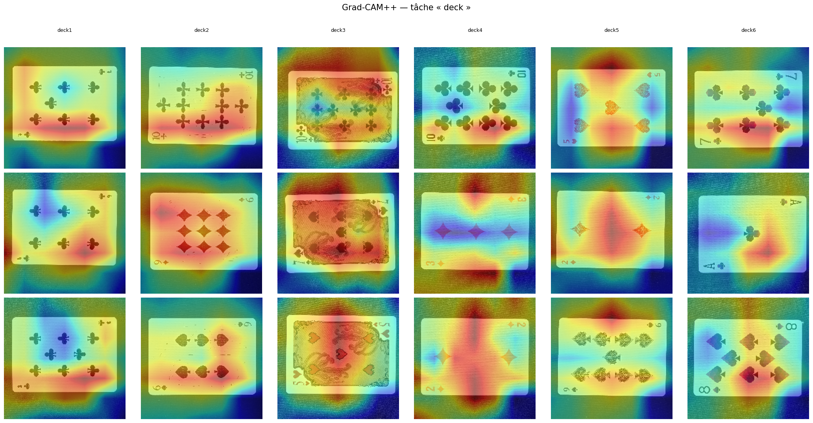
*Figure 13 : Grad-CAM++ sur des images de la tâche deck.*

La figure 13 est révélatrice du fonctionnement de la tâche deck : pour les jeux au style très distinctif (par exemple deck3, dont le motif couvre toute la carte), l'activation s'étend sur l'ensemble de la surface ; pour les autres, elle se répartit sur la carte et ses bords. Le modèle s'appuie donc sur le style graphique global du jeu, illustrations, fond, polices, ce qui explique son excellent score. Ce comportement éclaire aussi une limite : une partie de l'information exploitée provient du contexte et des bords de la carte (« shortcut learning »), ce qui rend le modèle sensible au cadrage, comme le confirmeront les tests réels.

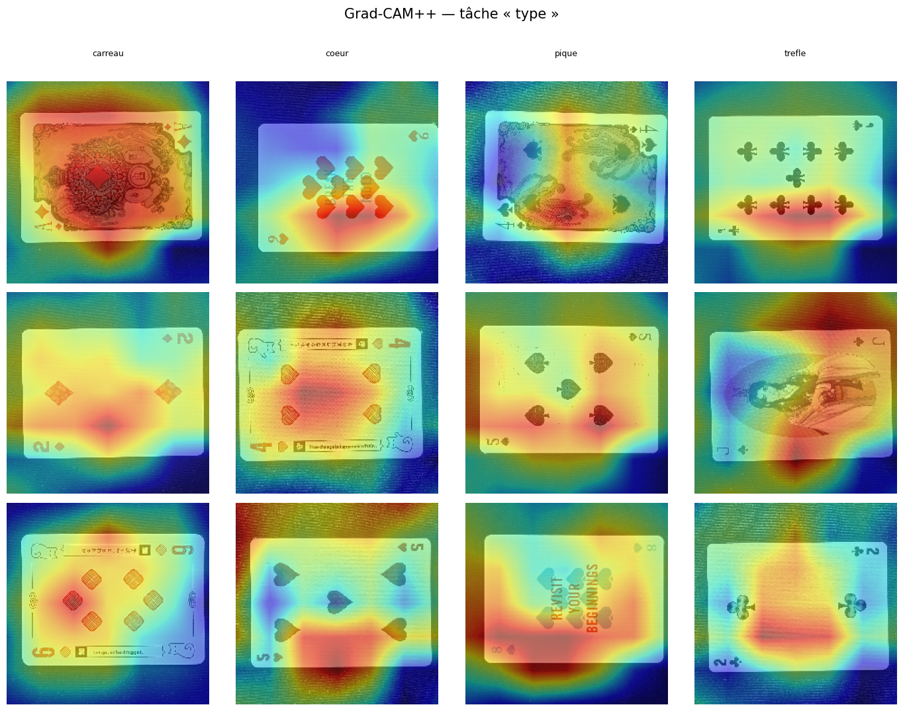
*Figure 14 : Grad-CAM++ sur des images de la tâche type.*

Pour la tâche type (figure 14), on observe que l'activation ne se concentre pas toujours sur les symboles eux-mêmes mais déborde fréquemment sur les bords et l'arrière-plan, ce qui traduit la même dépendance partielle au contexte et explique les confusions entre enseignes de même couleur.

### 5.4 Images mal classées

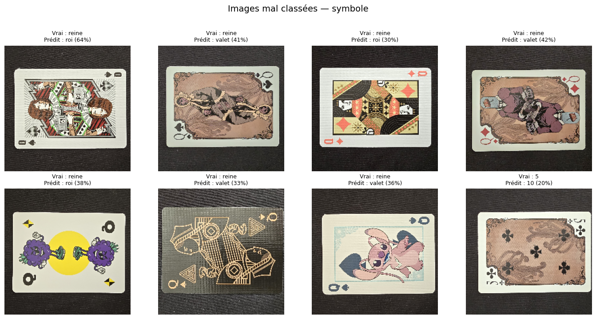
*Figure 15 : Exemples d'images de test mal classées, tâche symbole.*

L'examen des erreurs confirme les patterns des matrices de confusion : pour symbole, les valeurs voisines sont systématiquement mélangées et les figures se confondent entre elles ; pour type, la quasi-totalité des erreurs sont des confusions entre enseignes de même couleur ; pour deck, les rares erreurs concernent des jeux visuellement proches.

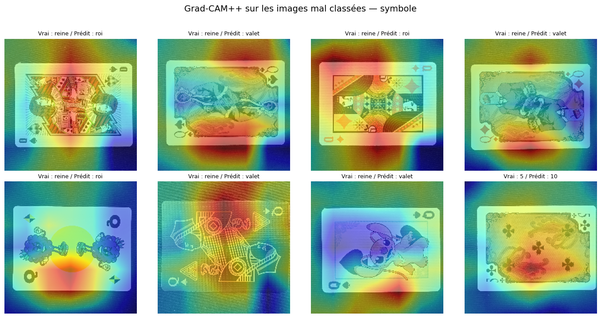
*Figure 16 : Grad-CAM++ sur des images de test mal classées, tâche symbole.*

### 5.5 Tests en conditions réelles sur smartphone

Les quatre modèles ont été convertis au format TensorFlow.js et intégrés dans une application web mobile qui exécute les quatre classifications en parallèle sur le flux de la caméra, avec un seuil d'incertitude réglable en dessous duquel la prédiction est remplacée par « Incertain ». Les tests ont été menés sur fond sombre, comme à l'entraînement, en mélangeant des cartes de jeux connus du dataset et un jeu inconnu. Le tableau suivant récapitule les sept tests effectués (la mention du seuil indique le réglage au moment de la capture).

| Carte / deck réel | couleur | type | symbole | deck | Seuil |
|---|---|---|---|---|---|
| Joker, deck 4 | Bleu 35 % | Carreau 59 % | Joker 22 % ✓ | Autre 24 % ✗ | 0 % |
| 2 de pique, jeu inconnu | Noir 78 % ✓ | Pique 56 % ✓ | 2 49 % ✓ | Autre 78 % ✓ | 45 % |
| 6 de pique, deck 7 | Noir 60 % | Pique 84 % ✓ | 7 37 % ✗ | Deck1 50 % ✗ | 20 % |
| Roi de pique, deck 11 | Rouge 47 % ✗ | Pique 33 % ✗ | Reine 35 % ✗ | Deck11 40 % ✓ | 20 % |
| 9 de cœur, deck 11 | Rouge 84 % ✓ | Coeur 39 % ✓ | 5 27 % ✗ | Deck11 97 % ✓ | 20 % |
| Dame, deck 9 | Bleu 36 % | Coeur 55 % | Reine 14 % ✓ | Deck9 26 % ✓ | 0 % |
| Carte partielle, deck 11 | Noir 94 % | Trefle 53 % | As 36 % | Autre 38 % ✗ | 0 % |

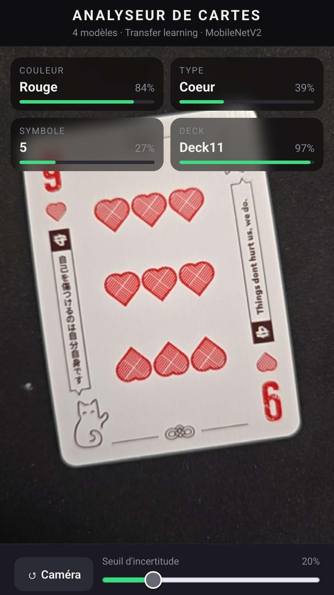
*Figure 17 : 9 de cœur du deck 11 : couleur (Rouge 84 %), type (Cœur) et surtout deck (Deck11 97 %) corrects ; seul le symbole échoue.*

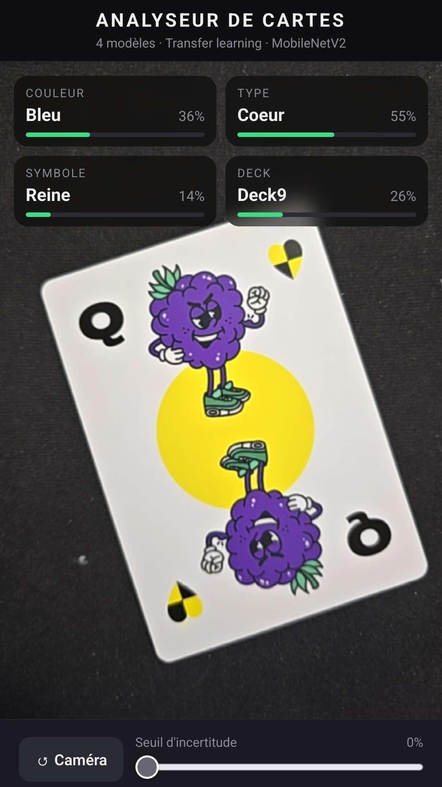
*Figure 18 : Dame du deck 9 : symbole (Reine) et deck (Deck9) corrects sur un jeu au style très particulier.*

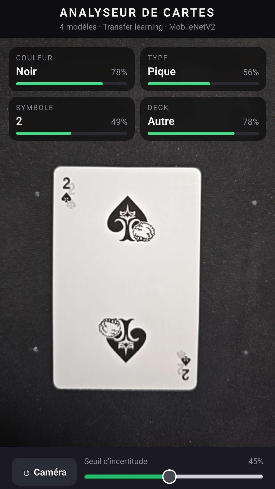
*Figure 19 : 2 de pique d'un jeu inconnu : les quatre attributs sont corrects, dont deck « Autre » à 78 %, illustrant le mécanisme de rejet.*

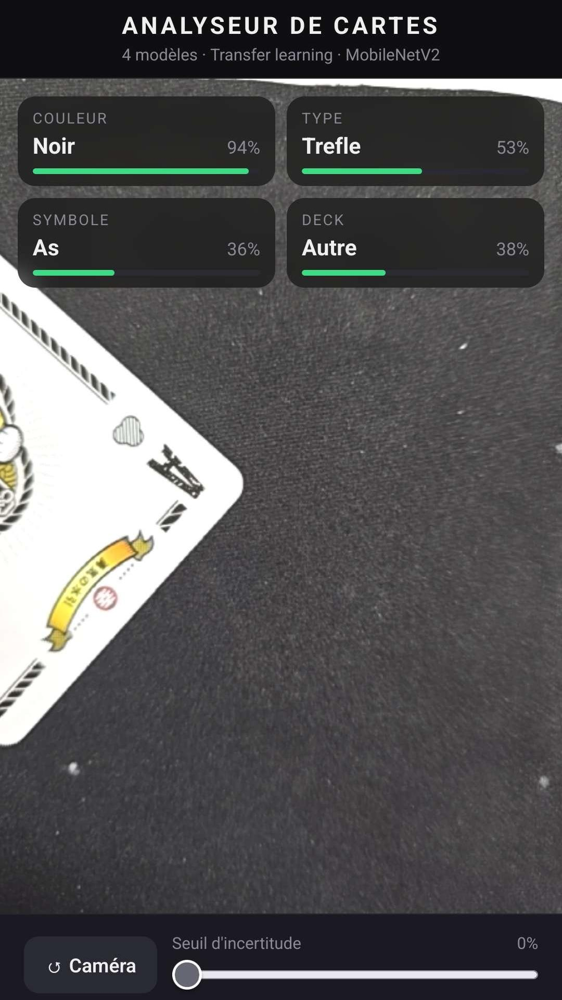
*Figure 20 : Carte du deck 11 partiellement hors champ : faute de voir l'ensemble de la carte, le modèle deck la classe « Autre ».*

Plusieurs enseignements se dégagent. Premièrement, la tâche **deck** confirme en conditions réelles son statut de tâche la plus performante : elle identifie correctement le jeu lorsque celui-ci est connu et bien cadré (Deck11 à 97 % sur le 9 de cœur, Deck9 sur la dame), et bascule sur « Autre » pour un jeu inconnu (le 2 de pique). Deuxièmement, ces mêmes tests exposent la dépendance au cadrage anticipée par le Grad-CAM : la carte partiellement hors champ (deck 11 réel) est classée « Autre », et le joker du deck 4 n'est pas reconnu comme tel, quand le modèle ne voit pas l'ensemble carte + contexte, son indice principal disparaît. Troisièmement, **symbole** reste la tâche faible : elle réussit les cas nets (Joker, 2, Reine) mais se trompe sur la plupart des valeurs (7 au lieu de 6, 5 au lieu de 9), confirmant que compter les symboles dépasse les capacités du modèle. Enfin, **couleur** et **type** se comportent conformément à leurs scores hors-ligne, avec de bonnes prédictions sur les cartes nettes et quelques hésitations. On notera que plusieurs captures ont été réalisées avec un seuil d'incertitude très bas (0 à 20 %), ce qui laisse afficher des prédictions peu fiables ; relever le seuil masquerait ces prédictions douteuses au profit d'un « Incertain » plus prudent.

### 5.6 Pistes d'amélioration du dataset et du système

Les analyses suggèrent des améliorations concrètes. Pour le dataset : diversifier les arrière-plans et les conditions d'éclairage afin de réduire la dépendance au contexte mise en évidence par le Grad-CAM, notamment pour deck ; augmenter le nombre d'images pour les classes rares (joker pour symbole, classe « autre » pour deck, bleu et jaune pour couleur) ; et enrichir la tâche symbole, de loin la plus faible. Pour le système : augmenter le nombre d'époques pour symbole, qui est manifestement sous-entraîné ; envisager un fine-tuning des dernières couches de MobileNetV2 avec un taux d'apprentissage très faible, en particulier pour symbole dont la tâche (compter des symboles) est la plus éloignée d'ImageNet ; améliorer le cadrage à l'inférence (détection préalable de la carte, recadrage automatique) pour fiabiliser deck et type ; et exploiter davantage le seuil d'incertitude, voire le régler par tâche selon la fiabilité observée.

## 6. Conclusions

Ce travail nous a fait parcourir l'intégralité du cycle de vie d'une application de classification d'images : constitution d'un dataset original de plus de 2000 photographies issues de seize jeux de cartes, préparation et augmentation des données, entraînement par transfer learning de quatre classifieurs MobileNetV2, sélection par validation croisée, évaluation sur jeu de test, analyse par Grad-CAM++ et déploiement réel sur smartphone via TensorFlow.js.

Les résultats illustrent de manière frappante que la difficulté d'une tâche de classification ne dépend pas du nombre de classes mais de la nature des caractéristiques discriminantes : avec la même architecture, l'identification du jeu d'origine atteint 85.5 % d'accuracy en test sur 17 classes et la couleur 79.7 % sur 5 classes, tandis que la reconnaissance de la valeur (symbole) reste proche de l'inutilisable (31.1 % sur 14 classes), compter des symboles ou distinguer des figures finement dessinées excède ce que des caractéristiques ImageNet gelées peuvent offrir avec si peu de données. L'analyse Grad-CAM a révélé que les modèles, en particulier deck, s'appuient en partie sur le style graphique global et le contexte de la carte ; les tests réels en ont confirmé les conséquences, positives (excellente reconnaissance des jeux connus, rejet fonctionnel des jeux inconnus) comme négatives (sensibilité au cadrage, échec sur une carte partiellement visible).

Le système constitue une preuve de concept fonctionnelle : trois attributs sur quatre (couleur, type, deck) sont reconnus de façon exploitable en temps réel sur smartphone, le regroupement des valeurs dans une unique tâche symbole a résolu le problème d'exclusivité figure/nombre, et la classe « autre » dote le système d'un mécanisme de rejet effectif. Les travaux futurs les plus prometteurs sont l'enrichissement et la diversification du dataset, l'allongement de l'entraînement et le fine-tuning partiel du réseau pour la tâche symbole, ainsi qu'une étape de détection et de recadrage de la carte en amont de la classification.
